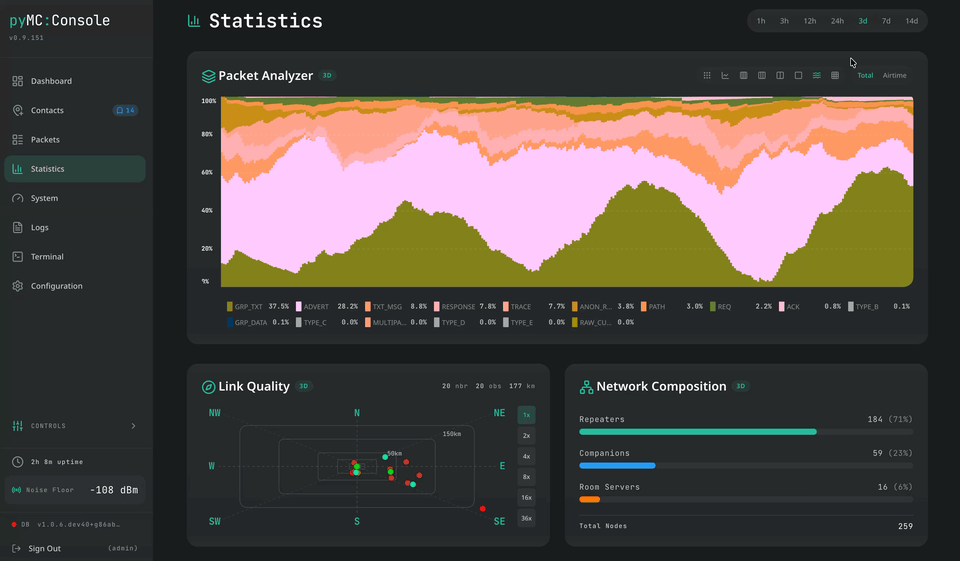
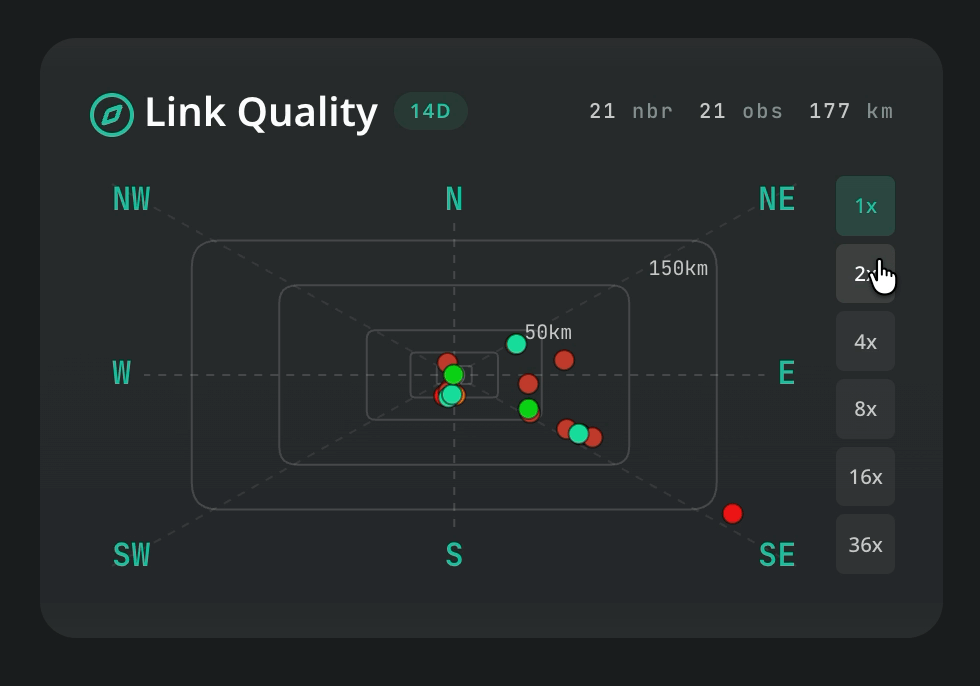
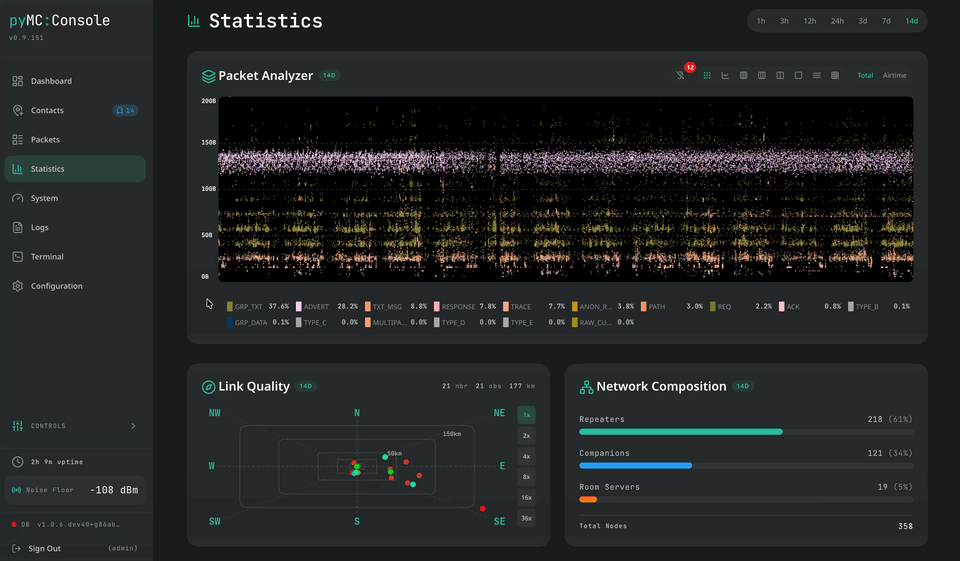
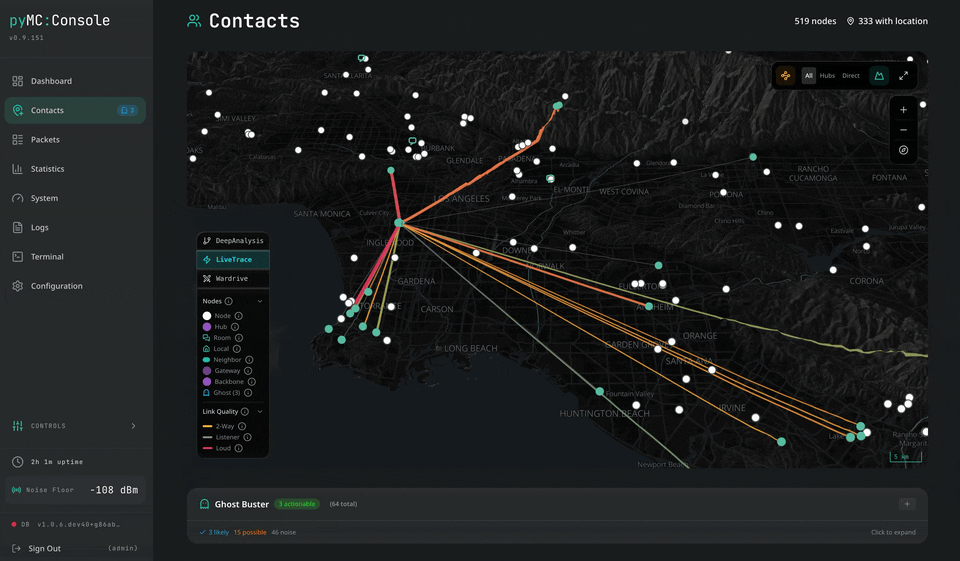
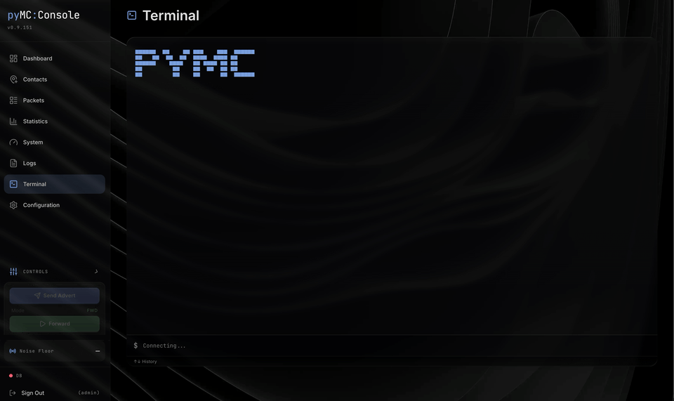

# pyMC Console

[](https://github.com/dmduran12/pymc_console-dist/releases)
[](LICENSE)

A real-time web dashboard for [MeshCore](https://meshcore.co.uk/) LoRa mesh repeaters.

pyMC Console gives you full visibility into your mesh network — packet flow, topology, signal quality, RF metrics, and radio configuration — through a single browser tab. It layers on top of [pyMC_Repeater](https://github.com/rightup/pyMC_Repeater) without modifying it.

---

## Quick Start

### Requirements

- Raspberry Pi (3, 4, 5, or Zero 2 W)
- LoRa radio module (SX1262 or SX1276)
- Raspberry Pi OS (Bookworm recommended)

### Install

```bash
git clone https://github.com/dmduran12/pymc_console-dist.git pymc_console
cd pymc_console
sudo bash manage.sh install
```

During installation you'll be prompted to select a pyMC_Repeater branch — **choose `dev`** (the default). The `dev` branch has the latest features and is the recommended target.

The installer handles everything:

1. System dependencies (Python, pip, SPI tools)
2. Clones and installs [pyMC_Repeater](https://github.com/rightup/pyMC_Repeater) + [pyMC_core](https://github.com/rightup/pyMC_core)
3. Deploys the Console web dashboard
4. Configures and starts the systemd service

Once complete, open `http://<your-pi-ip>:8000` in a browser.

### Upgrade

```bash
cd pymc_console
sudo bash manage.sh upgrade
```

Choose **Console only** (updates just the dashboard) or **Full Stack** (updates Console + pyMC_Repeater + pyMC_core). Console-only upgrades are safe and fast — your repeater config is untouched.

### Uninstall

```bash
cd pymc_console
sudo bash manage.sh
```

Select **Uninstall** from the menu. Removes all installed files, config, logs, and the systemd service.

---

## How It Fits Together

```
┌─────────────────────────────────────────────────────────────┐
│                      pyMC Console                           │
│            (this repo — web dashboard UI)                   │
│                                                             │
│  • React SPA served on port 8000                            │
│  • Real-time packets, topology, stats, radio config         │
│  • manage.sh installer handles everything                   │
└─────────────────────┬───────────────────────────────────────┘
                      │ uses API from
┌─────────────────────▼───────────────────────────────────────┐
│                    pyMC_Repeater                             │
│            (RightUp's repeater daemon)                      │
│                                                             │
│  • Python daemon running the LoRa repeater                  │
│  • REST API + WebSocket on port 8000                        │
│  • Packet forwarding, logging, radio control                │
└─────────────────────┬───────────────────────────────────────┘
                      │ built on
┌─────────────────────▼───────────────────────────────────────┐
│                      pyMC_core                              │
│             (RightUp's protocol library)                    │
│                                                             │
│  • Low-level MeshCore protocol implementation               │
│  • Radio drivers (SX1262, SX1276)                           │
│  • Packet encoding/decoding                                 │
└─────────────────────────────────────────────────────────────┘
```

**Key points:**
- Console does **not** replace Repeater — they work together
- `manage.sh` installs both Repeater and Console side-by-side
- You can upgrade Console independently without touching Repeater

---

## Features

### Topology Analysis

Reconstructs your network's structure from packet paths using a **Viterbi HMM decoder** — resolving prefix collisions with physics-based RF constraints and real-world observation evidence.



- **One-click Deep Analysis** from up to 14 days of packet history
- **Viterbi HMM decoding** — resolves 2-char prefix collisions using geographic distance and LoRa range constraints
- **Ghost node discovery** — detects unknown repeaters when no known candidate fits
- **7-phase topology pipeline** — directional edges, betweenness centrality, mobile detection, TX delay recommendations, path health scoring
- **3D terrain** — AWS Terrarium elevation with hillshading; markers and edges drape onto the landscape
- **Wardriving overlay** — H3 hexagonal coverage tiles with SNR-based coloring
- **Edge confidence** — line thickness scales with observation count; color indicates certainty

### Link Quality Radar

Polar chart placing all contacts at their actual compass bearing and distance from your node.



- **Zero-hop neighbors** colored by SNR (green → yellow → orange → red)
- **Multi-hop contacts** at 33% opacity to distinguish direct RF from relayed
- **Hover tooltips** with full signal metrics (RSSI, SNR, distance, last seen)

### Statistics Dashboard

Comprehensive RF metrics and network composition analysis.



- **Airtime utilization** — RX/TX stacked area charts with peak and mean metrics
- **Packet type distribution** — treemap of ADVERT, TXT_MSG, ACK, TRACE, etc.
- **Network composition** — repeater / companion / room server breakdown
- **Noise floor heatmap** — interference patterns over time
- **Disambiguation health** — Viterbi confidence metrics and ghost node stats
- **TX delay recommendations** — slot-based timing optimization per node role

### Packet Path Tracing

Click any packet to visualize its route through the mesh with hop-by-hop confidence.



- **Confidence coloring** — Green (100%), Yellow (50–99%), Orange (25–49%), Red (<25%), Gray (ghost)
- **Interactive map** showing resolved path with intermediate hops
- **Signal details** — RSSI, SNR, and timing per packet
- **Byte-level breakdown** — header fields, payload structure, raw hex

### Themes & Terminal

Two polished color schemes and a built-in CLI for direct repeater interaction.



- **Breeze Dark / Breeze Light** — KDE Breeze-inspired themes with full design token system
- **Terminal** — interactive CLI mapped to API endpoints (get/set radio, ping, diagnostics)
- **Packet capture** — `start cap` / `end cap` / `export cap` for timed diagnostic snapshots
- **Live logs** — streaming from repeater with DEBUG/INFO toggle

---

## All Pages at a Glance

| Page | Route | What it does |
|------|-------|-------------|
| **Dashboard** | `/` | Live packet counters, sparkline trends, LBT widgets, recent packets |
| **Packets** | `/packets` | Searchable packet history with detail modal, path visualization, byte breakdown |
| **Contacts** | `/contacts` | MapLibre GL map with topology edges, ghost nodes, terrain, wardriving overlay |
| **Statistics** | `/statistics` | µPlot charts — airtime, packet types, noise floor, signal scatter, network composition |
| **Mesh Graph** | `/meshgraph` | GPU-accelerated force-directed graph (Cosmograph) |
| **System** | `/system` | CPU, memory, disk, temperature, processes, network I/O |
| **Logs** | `/logs` | Live log stream with level filtering |
| **Terminal** | `/terminal` | Interactive CLI — MeshCore commands, ping, diagnostics, captures |
| **Configuration** | `/configuration` | Radio settings, TX delays, transport keys, identity, theme, stealth location |

---

## Management

### manage.sh Menu

```bash
sudo bash manage.sh
```

```
┌────────────────────────────────────────────────┐
│  pyMC Console                                  │
│  Status: Running                               │
├────────────────────────────────────────────────┤
│  install    Fresh installation                 │
│  upgrade    Upgrade existing                   │
│  uninstall  Remove everything                  │
│  status     Show versions                      │
│  logs       View live logs                     │
│  exit       Exit                               │
└────────────────────────────────────────────────┘
```

- **Install** — Full Stack or Console-only
- **Upgrade** — Console-only (fast, safe) or Full Stack (Console + Repeater + Core)
- **Uninstall** — Removes everything (installation, config, logs, service)
- **Status** — Installed versions of Core, Repeater, Console
- **Logs** — Live journal output from the repeater

### Radio & GPIO Configuration

Radio and GPIO settings are managed by upstream pyMC_Repeater:

```bash
cd ~/pyMC_Repeater && sudo ./manage.sh
```

Or edit the config directly:

```yaml
# /etc/pymc_repeater/config.yaml
radio:
  frequency: 927875000      # Hz
  spreading_factor: 7       # SF7–SF12
  bandwidth: 62500          # Hz
  tx_power: 28              # dBm
  coding_rate: 6            # 4/5, 4/6, 4/7, 4/8
```

> You can also change radio settings live from the **Configuration** page in the dashboard — no SSH required.

### DIO2 / DIO3 Pin Configuration

Some LoRa modules need specific DIO pin settings. These are **independent** — enabling one does not affect the other:

- **DIO3 (TCXO)** — set `use_dio3_tcxo: true` if your module has a temperature-compensated oscillator on DIO3
- **DIO2 (RF Switch)** — set `use_dio2_rf: true` if your module uses DIO2 for TX/RX antenna switching

```yaml
radio:
  use_dio3_tcxo: true
  use_dio2_rf: true       # dev branch only
```

### Service Management

```bash
sudo systemctl status pymc-repeater     # Check status
sudo systemctl restart pymc-repeater    # Restart
sudo journalctl -u pymc-repeater -f     # Live logs
```

---

## Directory Layout

After installation:

```
~/pymc_console/               ← This repo (cloned by you)
~/pyMC_Repeater/              ← Repeater daemon (cloned by manage.sh)

/opt/pymc_repeater/           ← Installed repeater
/opt/pymc_console/web/html/   ← Installed dashboard
/etc/pymc_repeater/config.yaml ← Radio + repeater configuration
/var/log/pymc_repeater/       ← Log files
```

---

## Hardware

### Supported Boards

- Raspberry Pi 3, 4, 5
- Raspberry Pi Zero 2 W
- Any SBC with SPI and GPIO (untested but likely works)

### Tested Radio Modules

- Waveshare SX1262 HAT
- Ebyte E22 modules
- LILYGO T3S3 (via USB serial)
- Heltec LoRa 32

### Connection

LoRa module connects via **SPI** with GPIO pins for reset, busy, and DIO1. Pin mapping is configured during installation via pyMC_Repeater's manage.sh.

---

## Troubleshooting

### Dashboard won't load

1. **Is the service running?**
   ```bash
   sudo systemctl status pymc-repeater
   ```
2. **Is port 8000 responding?**
   ```bash
   curl -s http://localhost:8000/api/stats | head -c 100
   ```
3. **Check for errors:**
   ```bash
   sudo journalctl -u pymc-repeater -n 50
   ```

### Login fails / "Error 200"

Usually caused by a version mismatch between Console and Repeater.

```bash
cd pymc_console
sudo bash manage.sh upgrade
```

Select **Full pyMC Stack** to update everything to compatible versions.

### No packets being received

1. **SPI enabled?**
   ```bash
   ls /dev/spidev*
   ```
   If no devices listed, enable SPI via `raspi-config` → Interface Options → SPI.

2. **GPIO correct?** Run pyMC_Repeater's manage.sh → Configure GPIO and verify pin assignments match your wiring.

3. **Frequency match?** Confirm your radio frequency matches the rest of your mesh network.

4. **Check the logs:**
   ```bash
   sudo journalctl -u pymc-repeater -n 100 | grep -i "error\|fail\|radio"
   ```

### Service won't start

```bash
# Check for config syntax errors
python3 -c "import yaml; yaml.safe_load(open('/etc/pymc_repeater/config.yaml'))"

# Check for Python dependency issues
pip3 show pymc-repeater pymc-core
```

### "Radio presets file not found" during install

Non-fatal warning. The installer fetches presets from an API; if unavailable, it falls back to common defaults. Installation continues normally.

### Dashboard loads but shows no data

- The dashboard requires authentication. If you see the login page, use the credentials you set during pyMC_Repeater installation.
- If you're on a fresh install, allow 30–60 seconds for the repeater to initialize and begin receiving packets.
- Check that WebSocket is connecting: open browser DevTools → Network → WS. You should see an active `/ws/packets` connection.

### Upgrade didn't take effect

Hard-refresh your browser (`Cmd+Shift+R` / `Ctrl+Shift+R`) to clear the cached SPA bundle. Vite hashes filenames, but the browser may still cache `index.html`.

---

## Under the Hood

### Viterbi Path Disambiguation

MeshCore packets contain 2-character hex prefixes representing the route through the mesh:

```
Path: ["FA", "79", "24", "19"]
       Origin → Hop1 → Hop2 → Local
```

Multiple nodes can share the same 2-char prefix (1-in-256 collision). The system uses a **Viterbi HMM decoder** to find the most probable sequence of actual nodes:

- **States** — all candidate nodes matching each prefix, plus a "ghost" state for unknowns
- **Priors** — recency-weighted (recently-seen nodes are more likely)
- **Transitions** — physics-based costs using geographic distance and LoRa range constraints
- **Key principle** — when edge observations have ≥80% confidence, real-world evidence overrides physics

Before Viterbi decoding, candidates are scored using **four-factor analysis**:

1. **Position (15%)** — typical path positions for this prefix
2. **Co-occurrence (15%)** — which prefixes appear adjacent
3. **Geographic (35%)** — distance to dual-hop anchor points
4. **Recency (35%)** — exponential decay `e^(-hours/12)`

### Ghost Node Discovery

When no known candidate is geographically plausible, the decoder selects a "ghost" state. These are clustered and classified into four tiers:

- **Confirmed** — very high observation count, consistent neighbors, plausible location
- **Likely** — strong evidence, probably a real undiscovered repeater
- **Possible** — moderate evidence, worth investigating
- **Noise** — low evidence, likely path artifacts

Ghost clusters include RF-constrained location estimates, temporal consistency analysis, and collision detection against known nodes.

### 7-Phase Topology Pipeline

1. **Directional edge tracking** — forward/reverse counts, symmetry ratio
2. **Path sequence registry** — all observed paths, canonical detection
3. **Flood vs direct classification** — per-edge routing type
4. **Edge betweenness centrality** — backbone identification
5. **Mobile repeater detection** — path volatility analysis
6. **TX delay recommendations** — slot-based timing optimization
7. **Path health scoring** — combined health, weakest link, latency

### Protocol Library

The frontend includes a complete TypeScript port of the MeshCore protocol — binary packet parsing, header bit-field extraction, per-type payload decoders, channel key derivation, and GRP_TXT decryption (SHA-256, AES-ECB, pure JS — no native dependencies).

---

## Standalone UI Installation

If you already have pyMC_Repeater running and just want the dashboard, see [INSTALL.md](INSTALL.md) for manual tar.gz installation without manage.sh.

---

## License

MIT — See [LICENSE](LICENSE)

## Credits

Built on the work of:

- **[RightUp](https://github.com/rightup)** — Creator of pyMC_Repeater, pymc_core, and the MeshCore Python ecosystem
- **[pyMC_Repeater](https://github.com/rightup/pyMC_Repeater)** — Core repeater daemon
- **[pymc_core](https://github.com/rightup/pyMC_core)** — Protocol library
- **[MeshCore](https://meshcore.co.uk/)** — The MeshCore project and community
- **[d40cht/meshcore-connectivity-analysis](https://github.com/d40cht/meshcore-connectivity-analysis)** — Viterbi HMM approach for path disambiguation
- **[meshcore-bot](https://github.com/agessaman/meshcore-bot)** — Recency scoring and dual-hop anchor disambiguation
